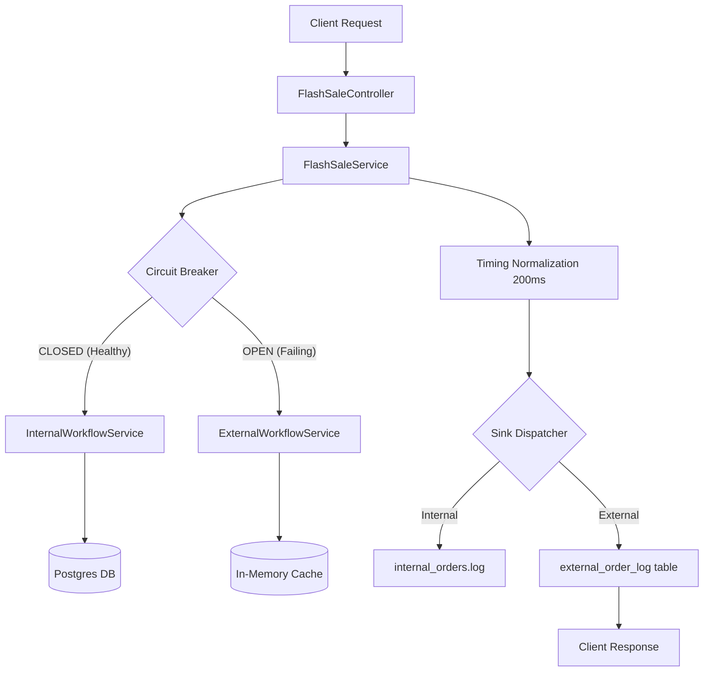

# Flash Sale Engine - Project Context & Documentation

This document provides a complete overview of the Flash Sale Engine, its architecture, requirements, and current implementation state as discussed during the development sessions.

---

## 1. Project Objective
The goal is to build a robust **Flash Sale Engine** designed to handle massive traffic spikes with a focus on system resilience, performance, and timing consistency. The system transparently routes requests between a primary (DB-driven) path and a fallback (cache-driven) path based on system health.

## 2. Core Requirements
- **MVC Architecture**: Clean separation of concerns.
- **Orchestration**: A central service that manages workflow routing, timing, and persistence.
- **Timing Normalization**: All workflows (successful or failed, internal or external) must take exactly the same amount of time (default: 200ms) to prevent side-channel timing attacks and ensure consistent client experience.
- **Dual Workflows**:
    - **Internal**: Real-time DB lookup (PostgreSQL) + Stock validation + File-based logging (NDJSON).
    - **External**: Fallback in-memory cache + Simulated stock + DB-based logging.
- **Circuit Breaker**: Automatic failover from Internal to External when the database is unhealthy or overloaded.
- **Transparent API**: The client should not know about internal/external routing.

---

## 3. Technology Stack
- **Language**: Java 17 / 21
- **Framework**: Spring Boot 3.2.5
- **Database**: PostgreSQL 16 (running in Docker)
- **Resilience**: Resilience4j (Circuit Breaker)
- **Monitoring**: Spring Boot Actuator
- **Documentation**: Markdown logs and project summaries

---

## 4. Architecture Overview

### **A. Flow Diagram**


---

## 5. Implementation Details

### **A. The Orchestrator (`FlashSaleService`)**
The brain of the system. It uses `CircuitBreakerRegistry` to wrap the internal call.
- **Timing**: Captures `startTime`, executes workflow, calculates `elapsed`, and calls `Thread.sleep(target - elapsed)` if necessary.
- **Normalization**: Ensures `executionTimeMs` is exactly the target duration.

### **B. Internal Workflow (`InternalWorkflowService`)**
- **Process**: Hits the `products` table, validates stock, and decrements it using JPA `@Transactional`.
- **Sink**: Appends order results as single-line JSON (NDJSON) to `output/internal-orders/internal_orders.log`.

### **C. External Workflow (`ExternalWorkflowService`)**
- **Process**: Uses a `ConcurrentHashMap` pre-warmed with product data. Keyed by `productId` to match the internal API.
- **Sink**: Inserts logs into the `external_order_log` table.
- **Resilience**: The sink write is wrapped in a try-catch to ensure that even if the DB is entirely down, the in-memory processing still succeeds.

### **D. Circuit Breaker Configuration**
Configured in `application.properties`:
- **Sliding Window**: 3 calls (tuned for 3-instance cluster).
- **Failure Threshold**: 50%.
- **Minimum Calls**: 2 (fast detection under load balancing).
- **Slow Call Threshold**: 80% (calls > 2s).
- **Wait Duration**: 10s (time before trying to recover).

---

## 6. API Specification

### **Process Order**
`POST /api/flash-sale/order`

**Request Body:**
```json
{
  "productId": 1,
  "quantity": 2
}
```

**Response Body:**
```json
{
  "workflow": "INTERNAL",
  "productName": "iPhone 15 Pro",
  "requestedQuantity": 2,
  "unitPrice": 899.99,
  "totalPrice": 1799.98,
  "remainingStock": 42,
  "status": "SUCCESS",
  "message": "Order processed from DB inventory",
  "outputDestination": "File: output/internal-orders",
  "executionTimeMs": 200
}
```

---

## 7. Infrastructure (Docker)
The system relies on a PostgreSQL container:
- **Container Name**: `flashsale-db`
- **Port**: `5432`
- **Seed Script**: `01-seed.sql` populates the initial inventory and creates the logging table.

---

## 8. Current Status
- [x] Spring Boot project initialized.
- [x] PostgreSQL Dockerized and seeded.
- [x] Internal/External workflow separation implemented.
- [x] Timing normalization to target 200ms implemented.
- [x] Single log file (NDJSON) for internal workflow.
- [x] Resilience4j Circuit Breaker with auto-failover.
- [x] Resilient fallback cache (independent of DB).
- [x] Full end-to-end verification completed.
