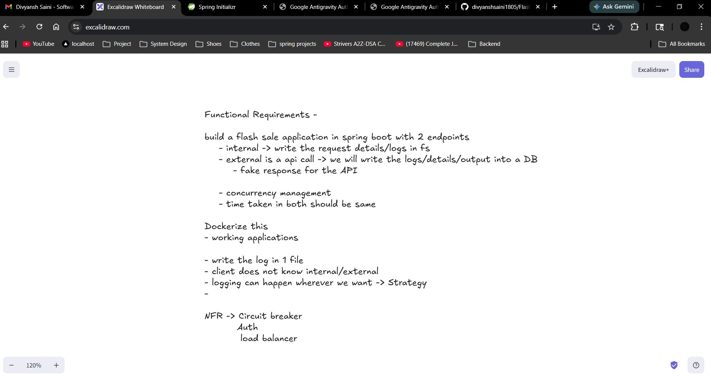

# ⚡ Flash Sale Engine

A production-grade, resilient Flash Sale system built with **Spring Boot 3**, **Resilience4j**, **JWT Security**, and **Nginx Load Balancing** — fully containerized with Docker Compose.

---

## 🎯 Problem Statement & Requirements




This project was built to satisfy the following technical requirements for a high-concurrency flash sale system:

### Functional Requirements
- **Dual Workflows**:
    - **Internal**: Real-time processing with logging to the local file system (NDJSON).
    - **External**: Simulated API call with logging to a central Database (PostgreSQL).
- **Transparency**: The client remains unaware of which workflow (Internal/External) is being used.
- **Timing Consistency**: Both workflows must take exactly the same amount of time to prevent side-channel leakage.
- **Concurrency Management**: Robust handling of simultaneous order requests.
- **Flexible Logging**: Implementation of the **Strategy Pattern** to allow switching log sinks at runtime.

### Non-Functional Requirements (NFR)
- **Circuit Breaker**: Automatic failover to the External workflow if the primary DB becomes unhealthy.
- **Authentication**: Secure JWT-based access control.
- **Load Balancing**: Horizontal scaling with Nginx distributing traffic across multiple app instances.
- **Dockerization**: The entire stack must be containerized and orchestrated.

---

## 🏁 Run It — One Command

> **Prerequisites:** Docker and Docker Compose installed.

The entire system — build, deploy, and **28 automated integration tests** — runs with a single command:

```bash
# Linux / macOS / WSL
bash test-all.sh

# Windows PowerShell
.\test-all.ps1
```

This will:
1. Build and launch **5 Docker containers** (PostgreSQL + 3 Spring Boot instances + Nginx LB)
2. Run **28 tests** across 7 phases — Auth, RBAC, Orders, Strategy Pattern, Load Balancing, Circuit Breaker
3. Print a full pass/fail report

**Expected output:**
```
  Total : 28
  Passed: 28 ✅
  Failed: 0 ❌

  🎉 ALL TESTS PASSED!
```

To tear down after reviewing:
```bash
docker-compose down -v
```

---

## 🏗️ Architecture

```
                         ┌──────────────┐
                         │    Client    │
                         └──────┬───────┘
                                │
                         ┌──────▼───────┐
                         │    Nginx     │  :80 (Load Balancer)
                         │  least_conn  │
                         └──┬───┬───┬───┘
                            │   │   │
                   ┌────────┘   │   └────────┐
                   ▼            ▼            ▼
             ┌──────────┐ ┌──────────┐ ┌──────────┐
             │  App:1   │ │  App:2   │ │  App:3   │
             │  :8080   │ │  :8080   │ │  :8080   │
             └────┬─────┘ └────┬─────┘ └────┬─────┘
                  │            │             │
                  │     ┌──────▼──────┐      │
                  │     │Circuit Break│      │
                  │     └──┬──────┬───┘      │
                  │  CLOSED│      │OPEN      │
                  │        ▼      ▼          │
                  │   ┌──────┐ ┌──────┐      │
                  │   │  DB  │ │Cache │      │
                  │   │(Real)│ │(Mem) │      │
                  │   └──────┘ └──────┘      │
                  │            │             │
                  └────────────┼─────────────┘
                               ▼
                        ┌──────────────┐
                        │  PostgreSQL  │  :5432
                        └──────────────┘
```

### What the test script validates (7 Phases)

| Phase | What It Tests | # Tests |
|-------|---------------|---------|
| **0** | Infrastructure — all 5 containers running | 1 |
| **1** | Health — app, actuator, circuit breaker, nginx | 4 |
| **2** | Auth — register, duplicate rejection, login, wrong password | 5 |
| **3** | RBAC — unauthenticated blocked, customer allowed, admin-only enforced | 4 |
| **4** | Orders — success, product details, insufficient stock, timing normalization | 4 |
| **5** | Strategy — switch logging to DB, verify, switch back to file | 3 |
| **6** | Load Balancing — 9 orders distributed across 3 instances | 2 |
| **7** | Circuit Breaker — stop DB, verify OPEN state, restart, verify recovery | 5 |

---

## 🔑 Key Design Decisions

### 1. Stateless JWT Authentication
Tokens carry the user's role in the claims. The auth filter **never hits the database** to validate a request — this is critical because it means authenticated requests still work even when the DB is completely down, allowing the circuit breaker to do its job.

### 2. Circuit Breaker (Resilience4j)
Wraps all DB calls. When PostgreSQL fails, the circuit opens and requests automatically route to an in-memory fallback cache. When the DB recovers, the circuit auto-closes.

### 3. Strategy Pattern (Logging)
Admins can switch the logging sink at runtime between **File** and **Database** without redeploying. Classic GoF Strategy pattern with a context class.

### 4. Timing Normalization
Every response is padded to exactly **200ms**. This prevents side-channel timing attacks — you can't tell if a request hit the fast cache or the slow DB.

### 5. Load Balancing
Nginx `least_conn` distributes traffic across 3 identical Spring Boot instances. JWT-based auth means any instance can handle any request — no sticky sessions.

---

## 📋 API Reference

### Public (No Auth)

| Method | Endpoint | Description |
|--------|----------|-------------|
| `POST` | `/api/auth/register` | Register customer |
| `POST` | `/api/auth/register/admin` | Register admin |
| `POST` | `/api/auth/login` | Login → JWT |
| `GET`  | `/api/flash-sale/health` | Health check |
| `GET`  | `/actuator/circuitbreakers` | CB status |

### Authenticated (JWT Required)

| Method | Endpoint | Role | Description |
|--------|----------|------|-------------|
| `POST` | `/api/flash-sale/order` | CUSTOMER, ADMIN | Place order |
| `POST` | `/api/flash-sale/config/logging?type={file\|database}` | ADMIN only | Switch log sink |

---

## 🛒 Quick Manual Test

```bash
# Health check
curl http://localhost/api/flash-sale/health

# Register + Login
curl -s -X POST http://localhost/api/auth/register \
  -H "Content-Type: application/json" \
  -d '{"username":"john","password":"secret123"}'

TOKEN=$(curl -s -X POST http://localhost/api/auth/login \
  -H "Content-Type: application/json" \
  -d '{"username":"john","password":"secret123"}' | jq -r '.token')

# Place an order
curl -s -X POST http://localhost/api/flash-sale/order \
  -H "Content-Type: application/json" \
  -H "Authorization: Bearer $TOKEN" \
  -d '{"productId":1,"quantity":2}' | jq
```

**Response:**
```json
{
  "workflow": "INTERNAL",
  "productName": "iPhone 15 Pro",
  "requestedQuantity": 2,
  "unitPrice": 899.99,
  "totalPrice": 1799.98,
  "remainingStock": 48,
  "status": "SUCCESS",
  "message": "Order processed from DB inventory",
  "outputDestination": "File: output/internal-orders",
  "executionTimeMs": 200
}
```

---

## 📁 Project Structure

```
Flash-Sale-engine/
├── test-all.sh / test-all.ps1  # Automated E2E test suite (start here)
├── docker-compose.yml          # 5-container stack
├── Dockerfile                  # Multi-stage build (Maven → JRE Alpine)
├── nginx/nginx.conf            # LB config (least_conn)
├── init-db/01-seed.sql         # 10 products + order log table
├── ARCHITECTURE.md             # Deep-dive design document
└── src/main/java/com/flashsale/engine/
    ├── controller/             # REST endpoints (Auth + Flash Sale)
    ├── model/                  # JPA entities + DTOs
    ├── repository/             # Spring Data JPA repos
    ├── security/               # JWT filter, service, config
    ├── service/                # Orchestrator + Internal/External workflows
    ├── strategy/               # Logging strategy interface + impls
    └── utils/                  # Strategy context (LoggingFrameWork)
```

---

## 📝 License

This project is for educational and interview demonstration purposes.
